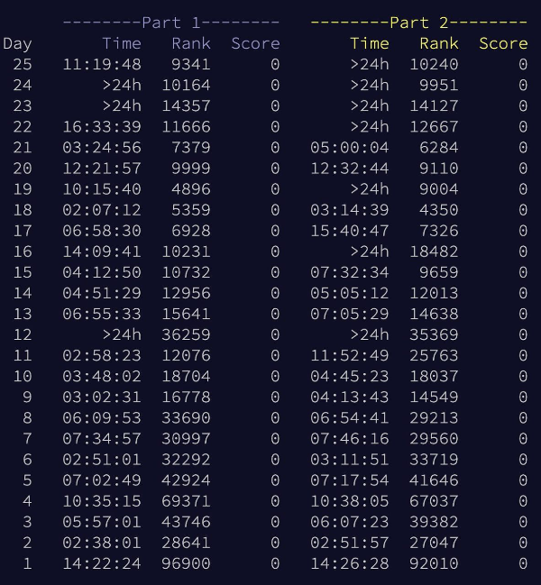

# Advent of Code 2022

My first year completing all of AoC. I didn't try to get on the leaderboard but still tried to solve everything "fast", i.e. spend as little time as possible building good and fast solutions and just get to a solution ASAP. On some of the days I spent a little time after refactoring but still to within where it still looks like the original solution I wrote (e.g. not copying a completely different solution from somewhere else or re-implementing stuff).

I only cheated on Day 12 because I didn't know the LCM trick and wouldn't have figured it out. Some solutions are pretty slow and non-optimal but still works within reasonable time.

Time was already scarce trying to do it during the month but got a bit too scarce towards the holidays as can be seen by the scoreboard xD

At the start I just did the task in whatever programming language I felt like, sometimes two different ones, then when the tasks got harder I just stuck to doing them in Rust, so it's mostly Rust.

### My final scoreboard



### Code Stats

```
-------------------------------------------------------------------------------
Language                     files          blank        comment           code
-------------------------------------------------------------------------------
Rust                            19            182            113           2000
Ruby                             9             72             31            402
Haskell                          5             66              2            221
-------------------------------------------------------------------------------
SUM:                            33            320            146           2623
-------------------------------------------------------------------------------
```

